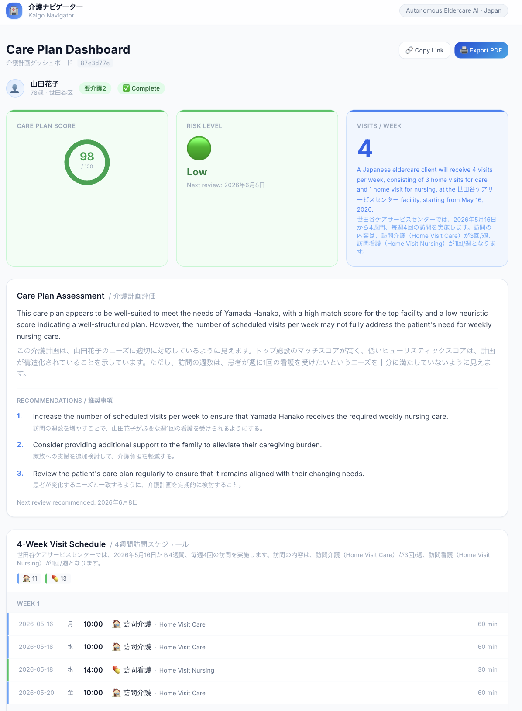
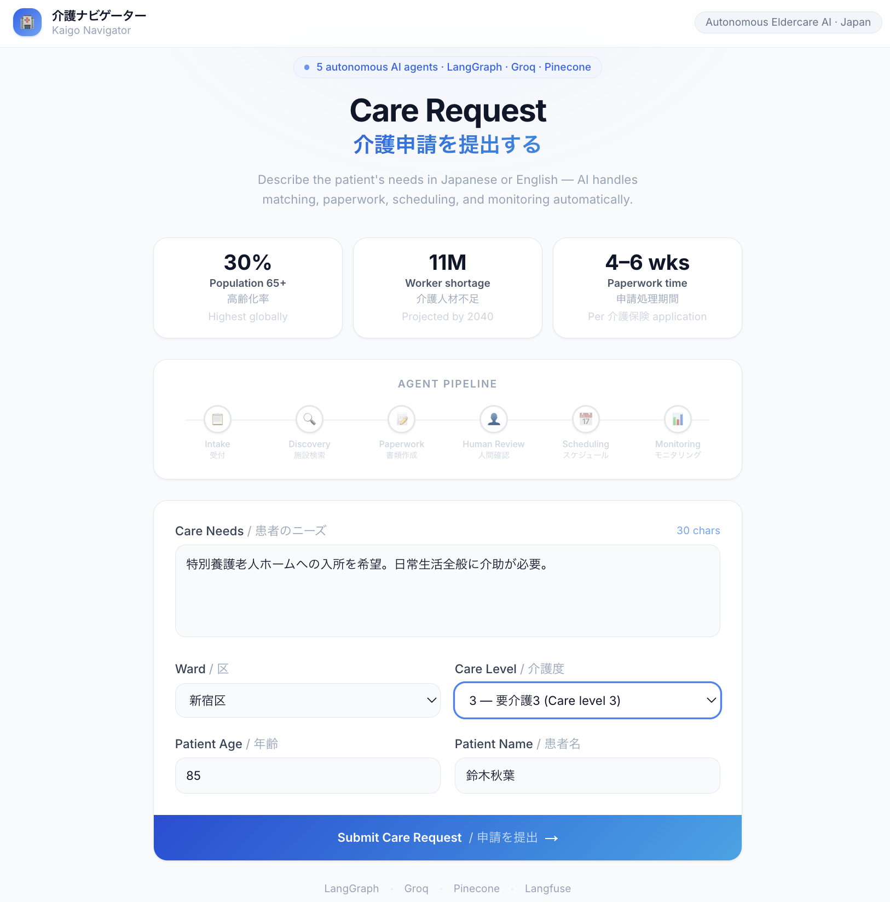
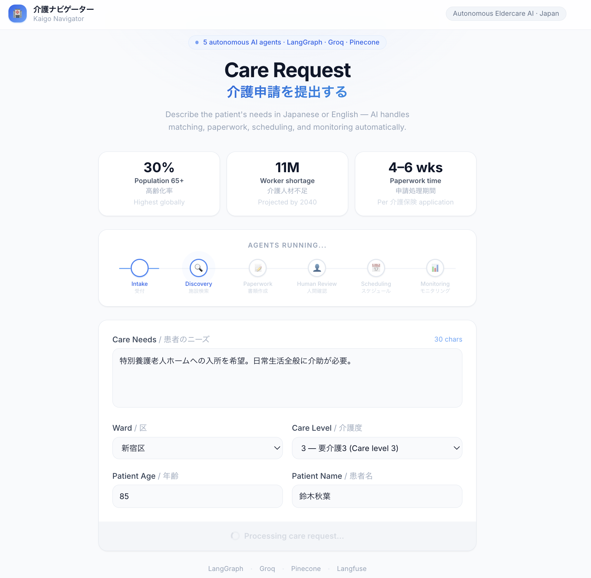
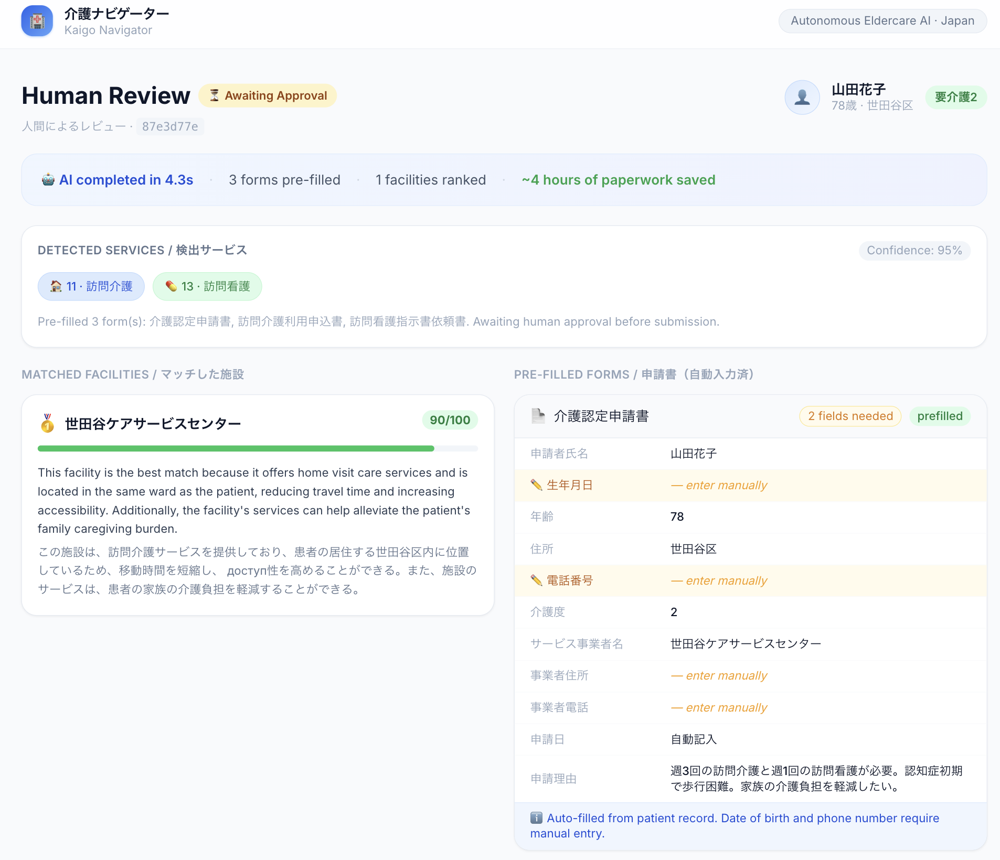
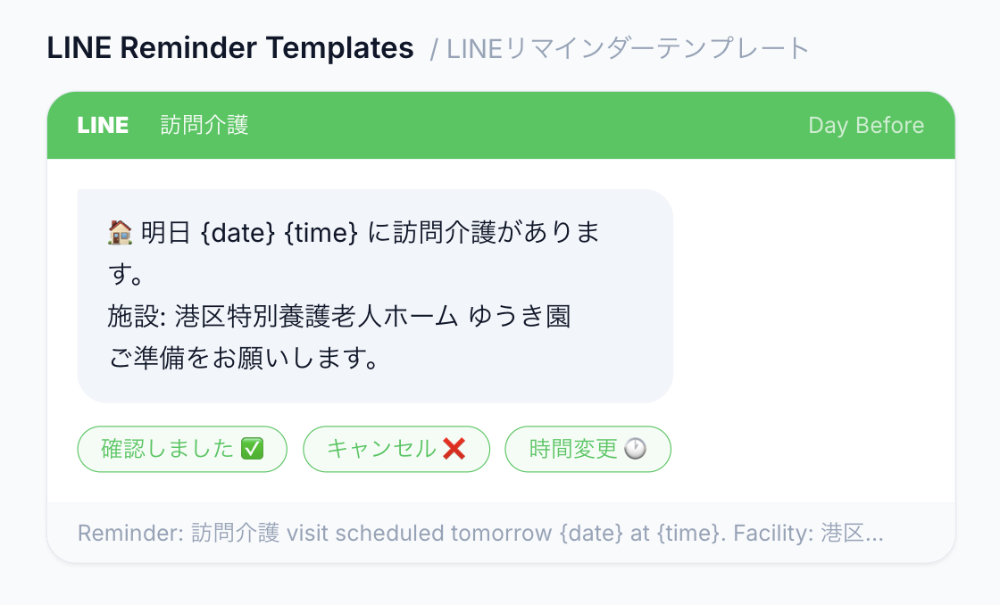

# 介護ナビゲーター — Kaigo Navigator

**Autonomous multi-agent AI for Japan's eldercare crisis.**  
One request. Five AI agents. Full care plan in seconds.


---

<p align="center">
  
</p>

---

## The Problem

Japan is aging faster than any country in history. The system built to support it hasn't kept up.

<table>
  <tr>
    <td align="center"><strong>30%</strong><br><sub>Population over 65</sub><br><sub>Highest globally</sub></td>
    <td align="center"><strong>11 million</strong><br><sub>Care worker shortage</sub><br><sub>Projected by 2040</sub></td>
    <td align="center"><strong>4–6 weeks</strong><br><sub>To navigate 介護保険 paperwork</sub><br><sub>Per application, manually</sub></td>
    <td align="center"><strong>3–7 forms</strong><br><sub>Per patient</sub><br><sub>All in Japanese bureaucracy</sub></td>
  </tr>
</table>

Families spend weeks manually matching facilities, filling kanji-dense government forms, and coordinating visit schedules — often with no professional guidance. Coordinators are overwhelmed. Facilities go unmatched. Patients wait.

**Kaigo Navigator replaces weeks of manual work with a 15-second AI pipeline.**

---

## Demo Walkthrough

### Step 1 — Submit a Care Request

Describe the patient's needs in Japanese or English. The system identifies required 介護保険 service codes, selects the ward, and submits to the 5-agent pipeline.

<p align="center">
  
</p>

---

### Step 2 — Watch the Agents Work

Five AI agents run in sequence: intake → service discovery (RAG) → paperwork → human review gate. The pipeline animates in real time, showing which agent is active.

<p align="center">
  
</p>

---

### Step 3 — Human Reviews AI-Prepared Work

The coordinator sees ranked facilities with match scores, and every required government form pre-filled by AI. A single click approves and resumes the pipeline.

<p align="center">
  
</p>

> *AI completed in ~15 sec · 3 forms pre-filled · 3 facilities ranked · ~4 hours of paperwork saved*

---

### Step 4 — Complete Care Plan Dashboard

After approval, the scheduling and monitoring agents run automatically. The coordinator receives a scored care plan, 4-week visit calendar, and LINE reminder templates — ready to send.

<p align="center">
  
</p>

<p align="center">
  
</p>

---

## How It Works — 5 AI Agents

```
 Care Request (JP or EN)
        │
        ▼
 ┌─────────────────┐
 │  Orchestrator   │  LangGraph StateGraph + SQLite checkpointing
 │  Llama 3.3 70B  │
 └────────┬────────┘
          │
    ┌─────┴──────────────────────┐
    ▼                            ▼
┌──────────────┐         ┌──────────────┐
│   Service    │         │  Paperwork   │
│  Discovery   │────────▶│    Agent     │
│ RAG + Llama  │         │  Llama 3.1   │
└──────────────┘         └──────┬───────┘
  Pinecone · ward filter         │
  multilingual-e5-large    ⏸ Human Gate
                                 │ (approve)
                           ┌─────┴───────┐
                           ▼             ▼
                    ┌────────────┐ ┌──────────────┐
                    │ Scheduling │ │  Monitoring  │
                    │   Agent    │ │    Agent     │
                    │ 4-wk plan  │ │ Score + Risk │
                    └────────────┘ └──────────────┘
                                         │
                                  Langfuse Traces
```

| Agent | Model | What It Does |
|-------|-------|--------------|
| **Orchestrator** | Llama 3.3 70B | Routes requests, manages LangGraph state |
| **Service Discovery** | Llama 3.3 70B + RAG | Free-text → 介護保険 codes → ranks facilities |
| **Paperwork** | Llama 3.1 8B | Identifies required forms, pre-fills all fields |
| **Scheduling** | Rule-based | 4-week visit calendar + LINE reminder templates |
| **Monitoring** | Llama 3.1 8B | Scores care plan 0–100, surfaces risk alerts |

---

## What Makes This Different

**Human-in-the-loop, not human-instead-of-loop.**  
The pipeline halts before any submission via a first-class LangGraph interrupt. State persists across the HTTP pause. The coordinator reviews and approves — the AI does the legwork.

**Bilingual throughout.**  
Every agent prompt, form field, ranked explanation, and dashboard label is in Japanese and English simultaneously. No switching, no translation step.

**Graceful degradation.**  
Every LLM call has a deterministic rule-based fallback. If Groq is down, the pipeline completes with heuristic output. It never crashes.

**Live government data.**  
The scraper pulls directly from MHLW's 介護サービス情報公表システム — Japan's official care facility registry — with ward-level filtering across all 23 Tokyo special wards.

---

## Tech Stack

| Layer | Technology | Role |
|-------|-----------|------|
| **UI** | Next.js 16 + Tailwind CSS | 3-page care coordinator interface |
| **API** | FastAPI + Pydantic v2 | REST layer, async, auto-documented |
| **Orchestration** | LangGraph 0.6 | Stateful multi-agent graph with HITL interrupt |
| **LLM** | Groq (Llama 3.3 70B / 3.1 8B) | Sub-second inference, bilingual |
| **Vector DB** | Pinecone | Ward + service code metadata filtering |
| **Embeddings** | multilingual-e5-large | JP + EN in the same vector space, local |
| **Observability** | Langfuse | Full trace on every agent step |
| **State** | SQLite + langgraph-checkpoint-sqlite | HITL pause/resume across requests |
| **Data** | MHLW 介護サービス情報公表システム | Official Japanese government registry |

---

## Quick Start

### Prerequisites
- Python 3.11+ · Node.js 18+
- API keys: `GROQ_API_KEY`, `PINECONE_API_KEY`, `LANGFUSE_PUBLIC_KEY`, `LANGFUSE_SECRET_KEY`

### Backend

```bash
git clone https://github.com/your-handle/kaigo-navigator.git
cd kaigo-navigator

python -m venv .venv && source .venv/bin/activate
pip install -r requirements.txt
pip install langgraph-checkpoint-sqlite

cp .env.example .env          # add your API keys

python scripts/ingest_data.py # ingest 9 sample facilities (instant)
uvicorn api.main:app --reload  # → http://localhost:8000
```

### Frontend

```bash
cd frontend
npm install
npm run dev                    # → http://localhost:3000
```

Open `http://localhost:3000` and submit a care request.

---

## API Reference

| Method | Endpoint | Description |
|--------|----------|-------------|
| `POST` | `/care-request` | Submit → runs agents → pauses at human gate |
| `GET` | `/care-request/{id}/review` | Fetch prefilled forms for human review |
| `POST` | `/care-request/{id}/approve` | Resume → scheduling → monitoring → complete |
| `GET` | `/care-request/{id}/schedule` | 4-week visit calendar + LINE templates |
| `GET` | `/care-request/{id}/monitoring` | Care plan score, risk level, recommendations |

Interactive docs: `http://localhost:8000/docs`

---

## Project Status

| Phase | Status | Scope |
|-------|--------|-------|
| **Phase 1** | ✅ Complete | RAG pipeline · Service Discovery · Langfuse observability |
| **Phase 2** | ✅ Complete | Paperwork Agent · human-in-the-loop approval gate |
| **Phase 3** | ✅ Complete | Scheduling Agent · Monitoring Agent · Next.js UI |
| **Phase 4** | 🔄 In progress | Eval harness (50 synthetic cases) · deployment |

---

## Contact

Built by **Ganesh Suni Jathar**

[LinkedIn](https://linkedin.com/in/your-handle) · [GitHub](https://github.com/your-handle)

*Built for Japan's eldercare crisis — 30% of the population is over 65, and the care system is running out of time.*
